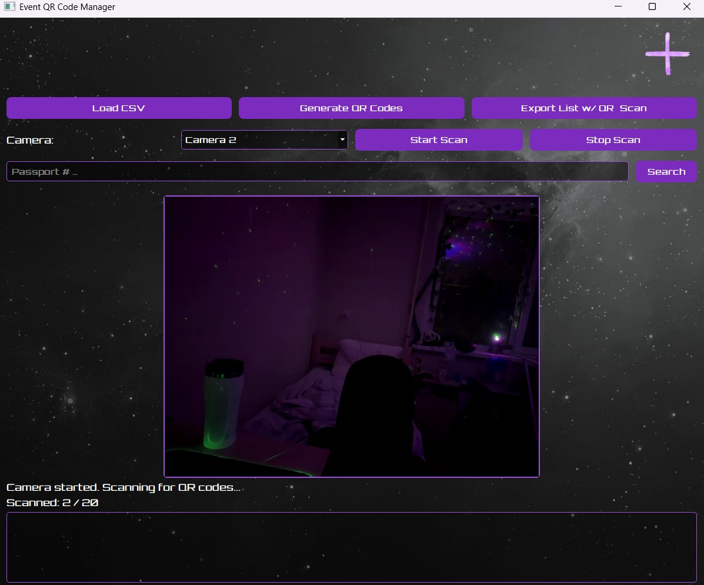

# Event QR Code Manager

A PyQt5 desktop application to manage event participant QR codes, including generating, scanning, and tracking attendance.

---

## Features

- Load participant data from a CSV file (requires columns: Name, Passport Number, Phone Number, Email).
- Automatically generate unique QR codes for each participant.
- Scan QR codes using a connected camera or a mobile phone (see below).
- Track scanned participants and reset counts.
- Export participant list with QR code filenames and scan status.
- Search participants by Passport Number.
- Stylish UI with custom font and background.

---

## Requirements

- Python 3.7+
- PyQt5
- pandas
- qrcode
- opencv-python
- pyzbar

Install dependencies using:

```bash
pip install -r requirements.txt
````

---

## Usage

Run the application:

```bash
python gatekeeper.py
```

1. Click **Load CSV** to select your participant CSV file.
2. Click **Generate QR Codes** to create QR code images saved in the `qrcodes` folder.
3. Use the **Start Scan** button to scan QR codes with your camera.
4. Scan QR codes to mark attendance. You can reset counts anytime.
5. Export the updated participant list with scan statuses using **Export List w/ QR & Scan**.
6. Search participants by passport number using the search bar.

---

## Using a Mobile Phone as a Scanner

You can also use your mobile phone as a camera scanner with the help of **DroidCam**:

1. Install the **DroidCam** app on your mobile phone (available on Google Play Store or Apple App Store).
2. Install the **DroidCam Client** on your computer from: [https://www.dev47apps.com/droidcam/windows/](https://www.dev47apps.com/droidcam/windows/)
3. Connect your phone and computer over Wi-Fi or USB using DroidCam.
4. In the application, select the DroidCam camera from the camera dropdown.
5. Start scanning QR codes using your phone camera streamed to the app.

---

## Screenshot



---

## Notes

* Ensure your CSV file includes these columns exactly: `Name`, `Passport Number`, `Phone Number`, `Email`.
* QR codes are saved in the `qrcodes` folder created automatically.
* Scanned data is saved back to the CSV to preserve state between sessions.

---

Enjoy managing your event attendance efficiently!

```
